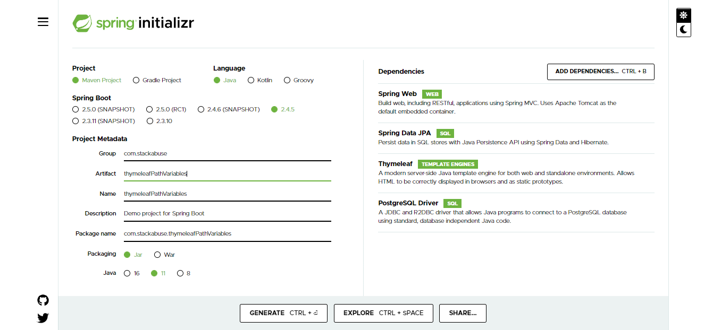
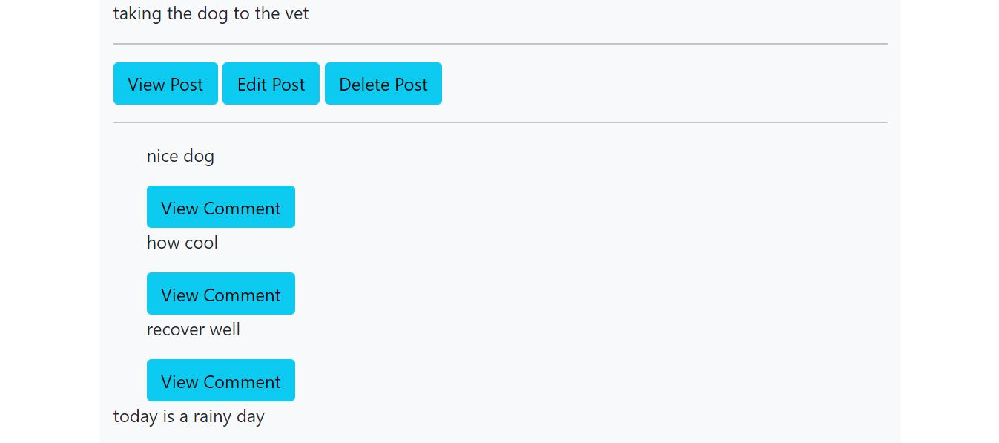
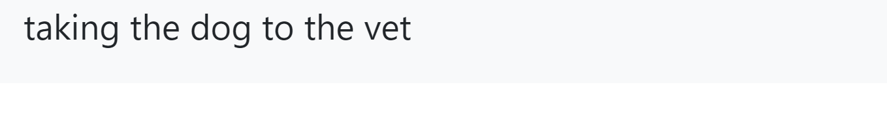
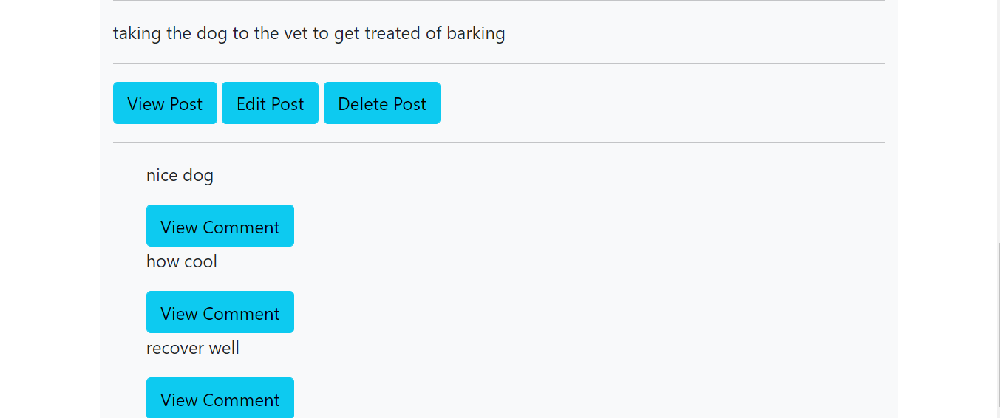

### Thymeleaf Path Variables with Spring Boot in Action

### Introduction
Thymeleaf is a templating engine that is mainly used by java developers to create web applications. Theymeleaf supports the dynamic features of a website by leveraging the data loaded on it. Thymeleaf makes use of the data by passing it to a uniform resource locator(URL) and the operation required is executed accordingly hence the name path variable. For example, when a customer is buying products online, the processes involved are viewing the specific product, adding to a cart, remove from a cart and all these operations make use of the path variables in an implemented site.
In this tutorial, the reader will learn how to perform read, update, and delete operations using Thymeleaf path variables then ramp up with an implementation of multiple variables. The application will make use of a `CommandLineRunner`to have some code running when the application starts. The case scenario will revolve around user posts and comments. 

### Requirements
- JDK 1.8 and above
- Intellij(use any preffered)
- Maven 

### Creating a Spring Boot project
We are going to use [Spring initializr](https://start.spring.io/) to generate a spring boot project including the maven dependencies that will be required in the application.
Fill in the properties as shown below and add the following dependencies.

- Spring Web - since we will be displaying data from the database, Spring web will be required to enable Model, View, and Controller patterns.
- Spring Data JPA - This adds persistence support and Hibernate to enable CRUD operations.
- Thymeleaf - A templating engine that adds dynamic data to HTML allowing different operations to be performed by leveraging hyperlinks.
- PostgreSQL Driver - A JDBC driver that allows java programs to connect to the PostgreSQL database using standard, database-independent Java code.



### Adding database connection properties to Spring Boot
In Spring Boot project navigate to `application.properties` and add the following configuration properties which will be used by spring boot behind the scenes to set up a database connection.
```java
spring.datasource.url=jdbc:postgresql://localhost:5432/profile
spring.datasource.username=postgres
spring.datasource.password=postgres
spring.jpa.hibernate.ddl-auto=create-drop
spring.jpa.show-sql=true
spring.jpa.properties.hibernate.dialect = org.hibernate.dialect.PostgreSQLDialect
spring.jpa.properties.hibernate.format_sql = true
```
- `datasource.url` indicates the database location as locally on your computer with localhost and the database name as profile.
- `datasource.username` sets the database username to postgres.
- `datasource.password` sets the database password to postgres.
- `jpa.hibernate.ddl-auto` is used to manage the database schema by creating all the relations when the application initializes and dropping all the relations when the application stops.
- `jpa.show-sql` when set to `true` will display all the queries generated by hibernate to the console.
- `jpa.properties.hibernate.dialect` indicates the type of database management system that is being used in the application as PostgreSQL
- `jpa.properties.hibernate.format_sql` makes the generated queries readable by adding indentation and structuring them properly.

### Creating a Post Model
A post will contain the following fields.
- id - To identify each post in the database uniquely.
- story - A simple text to indicate what a person posted.

```java 

@Entity(name = "Student")
@Table(name = "post")
public class Post {

    @Id
    @SequenceGenerator(
            name = "post_sequence",
            sequenceName = "post_sequence",
            allocationSize = 1
    )
    @GeneratedValue(
            strategy = GenerationType.SEQUENCE,
            generator = "post_sequence"
    )
    @Column(name = "id")
    private Long id;

    @Column(
            name = "story",
            nullable = false,
            columnDefinition = "TEXT"
    )
    private String story;

    // Generate Constructors, Getters, Setters, and toString 
}
```

### Creating a Comment Model
A comment will contain the following fields.
- id - To identify each post in the database uniquely.
- story - A simple text to indicate what a person commented regarding a particular post.

```java
@Entity(name = "Comment")
@Table(name = "comment")
public class Comment {
    @Id
    @SequenceGenerator(
            name = "comment_sequence",
            sequenceName = "comment_sequence",
            allocationSize = 1
    )
    @GeneratedValue(
            strategy = GenerationType.SEQUENCE,
            generator = "comment_sequence"
    )
    private Long id;

    @Column(
            name = "quote",
            nullable = false,
            columnDefinition = "TEXT"
    )
    private String quote;

    //Generate Constructors, Getters, Setters and toString
}
```

- @Id - indicates the field as the primary key for the entity.
- @SequenceGenerator - generates a sequence to increment the primary key. The parameter `allocationSize = 1` indicates that the primary key will be incremented by one each time a new record is created.
- @GeneratedValue - indicate the strategy used to generate the primary key as indicated by `GenerationType.SEQUENCE`. `generator = "post_sequence"`and `generator = "comment_sequence"` assign the generated value to a defined sequence.

### Adding OneToMany mapping in Post Model
A post has many comments and to implement this relationship in spring boot a `@OneToMany` strategy must be implemented in the `Post` class.

```java
 @OneToMany(
            mappedBy = "post",
            cascade = CascadeType.ALL,
            fetch = FetchType.EAGER
    )
    private List<Comment> comments = new ArrayList<>();
    //Generate Getters and Setters
```
- The relationship will be bidirectional thus `mappedBy="post"` was added to indicate the inverse side of the relationship.
- `CascadeType.ALL` performs every operation done on Post to the comment. For example, when a post is deleted the comment will also be deleted.
- `FetchType.EAGER` indicates that when a specific post is loaded the associated comments will also be loaded.

### Adding a ManyToOne mapping in Comment Model
- `@ManyToOne` tells hibernate that many comments belong to a single post.
```java
    @ManyToOne
    @JoinColumn(
            name = "post_id",
            referencedColumnName = "id",
            foreignKey = @ForeignKey(
                    name = "post_id_fk"
            )
    )
    private Post post;
    //Generate Getters and Setters
```
- `@JoinColumn` adds a field `post_id` to the comment entity to indicate a foreign key that references post id. `@ForeignKey` gives the foreign key a descriptive name as hibernate generates an arbitrary name which is can not be understood.

### Creating Post Repository Persistence Interface
- Create an Interface `PostRepository` that extends `JpaRepository` and passes `Post` and `Long` as the parameters.
```java
@Repository
public interface PostRepository extends JpaRepository<Post, Long> {
}
```
- `@Repository` indicates that the class is managed by the spring context.
- `PostRepository` can now be injected in any class and CRUD operations done on it.

### Creating a Post Controller
- This controller will be responsible for exchanging data to and from Thymeleaf templating engine.
- Create the `PostController` class and annotate with `@Controller` and `@RequestMapping` annotations.
- `@Controller` works the same way as `@Component` directing spring that the class is managed by the spring container.
- `@RequestMapping` on the class will set a default path to be used by post queries using HTTP.
```java
@Controller
@RequestMapping("/post")
public class PostController {
}
```
### Add View, Edit, and Delete methods in Post Controller
- `@PathVariable` is used to retrieve the variable that was passed in thymeleaf and pass it to the method.
- `Model` temporarily holds data that is being passed to and from thymeleaf template and the controller.
- This method will return a list of posts and associated comments to `all-posts` page.
```java
@GetMapping("/find/all")
    public String viewAllPostsAndComments(Model model){
        List<Post> postList = postRepository.findAll();
        model.addAttribute("thePosts",postList);
        return "all-posts";
    }
```
- This method will return a single post to `view-post` page.
```java
@GetMapping("/find/one/{postId}")
    public String viewPost(@PathVariable("postId") Long postId,
                                 Model model){
        Optional<Post> byId = postRepository.findById(postId);
        Post post = byId.get();
        model.addAttribute("post",post);
        return "view-post";
    }
```
- This method returns a post to edit to `update-post` page.
```java
@GetMapping("/edit/{postId}")
    public String editPost(@PathVariable("postId") Long postId,
                             Model model){
        Post post = postRepository.getOne(postId);
        System.out.println(post.toString());
        model.addAttribute("post",post);

        return "update-post";
    }
```
- This method returns all post after a post update to `all-posts` page.
```java
@PostMapping("/update")
    public String updatePost(@ModelAttribute("post") Post post){
        postRepository.save(post);
        return "redirect:/post/find/all";
    }
```
- This method returns all posts after a post delete to `all-posts` page.
```java
@GetMapping("/delete/one/{postId}")
    public String deletePost(@PathVariable("postId") Long postId){
        Post post = postRepository.getOne(postId);
        postRepository.delete(post);
        return "redirect:/post/find/all";
    }
```
### Creating all-posts, view-post, and update-post thymeleaf templates.
- `all-posts` template displays all posts,and links to view, update and delete a post.
- `<html lang="en" xmlns:th="http://www.w3.org/1999/xhtml">` enables thymeleaf in the html page.
```html
<div class="container">
    <div class="row">
        <div class="col-md-12 bg-light">
            <div th:each="post : ${thePosts}">
                <p th:text="${post.story}"></p>
                <hr>
                <span>
                    <a class="btn btn-info" th:href="@{/post/find/one/{postId}(postId=${post.id})}"> View Post</a>
                    <a class="btn btn-info" th:with="postId=${post.id}" th:href="@{${'/post/edit/'+postId}}">Edit Post</a>
                    <a class="btn btn-info" th:href="@{/post/delete/one/{postId}(postId=${post.id})}">Delete Post</a>
                </span>
                <hr>
            
            </div>

        </div>


    </div>

</div>
```
- `th` is the default syntax for thymeleaf expressions.
- `@{}` indicates a thymeleaf link.
- `${}` used to pass parameters as variables to thymeleaf links.
- `th:with` is used to hold a variable which can latter be passed as a path variable.
- Take note of the following links which makes use of path variables
 ```html
  <a class="btn btn-info" th:href="@{/post/find/one/{postId}(postId=${post.id})}"> View Post</a>
  <a class="btn btn-info" th:with="postId=${post.id}" th:href="@{${'/post/edit/'+postId}}">Edit Post</a>
  <a class="btn btn-info" th:href="@{/post/delete/one/{postId}(postId=${post.id})}">Delete Post</a>
 ```
 - `view-post` template is used to view a post.
 ```html
<div class="container">
    <div class="row">
        <div class="col-md-12 bg-light">
            <p th:text="${post.story}"></p>

        </div>

    </div>

</div>
 ```
 - `update-post` template is used to update a post that is prepopulated by the update method.
 ```html
<div class="container">
    <div class="row">
        <div class="col-md-12">
            <form action="#" th:action="@{/post/update}" th:object="${post}" method="post">
                <p><input type="hidden" th:field="*{id}"></p>
                <p>Post Something<input type="text" th:field="*{story}"></p>
                <p><input type="submit" value="Submit"> <input type="reset" value="Reset"></p>

            </form>

        </div>

    </div>

</div>
 ```
### Creating a Comment Repository persistence Interface
- Create a `CommentRepository` interface that extends `JpaRepository` and passes `Comment` and `Long` as the parameters.
- Annotate the class with `@Repository`.
```java
@Repository
public interface CommentRepository extends JpaRepository<Comment,Long> {
}
```
### Create a Comment Controller
- As indicated earlier the sole purpose of a controller is to pass data to and from the Thymeleaf template through a `Model`.
- Create the `@CommentController` class and annotate with `@Controller` and `@RequestMapping` annotations.
```java
@Controller
@RequestMapping("/comment")
public class CommentController {
}
```
- The default path for comment requests is via `/comment`.

### Add a View Comment Method in Comment Controller
- A comment belongs to a post, so to view a comment we have to pass a post identifier and the current comment identifier to retrieve the associated post comment.
- This is achieved by passing multiple variables to a method.
- This method returns a comment depending on the post that was passed to the `view-comment` template.
```java
@GetMapping("/find/one/{commentId}/post/{postId}")
    public String viewComment(@PathVariable("commentId") Long commentId,
                              @PathVariable("postId") Long postId,
                              Model model){
        Post post = postRepository.getOne(postId);

        List<Comment> comments = post.getComments();

        for (Comment comment : comments) {
            if (comment.getId() == commentId){
                model.addAttribute("comment",comment);
            }
        }

        return "view-comment";

    }
```
### Adding a View Comment link to all-posts template
- Edit `all-posts` template and add section that loops through all the loaded comments of each post as shown below.
```html
<div class="container">
    <div class="row">
        <div class="col-md-12 bg-light">
            <div th:each="post : ${thePosts}">
                <p th:text="${post.story}"></p>
                <hr>
                <span>
                    <a class="btn btn-info" th:href="@{/post/find/one/{postId}(postId=${post.id})}"> View Post</a>
                    <a class="btn btn-info" th:with="postId=${post.id}" th:href="@{${'/post/edit/'+postId}}">Edit Post</a>
                    <a class="btn btn-info" th:href="@{/post/delete/one/{postId}(postId=${post.id})}">Delete Post</a>
                </span>
                <hr>
                 <div th:each="comment : ${post.comments}" style="margin-left: 30px">
                     <p th:text="${comment.quote}"></p>
                     <a class="btn btn-info" th:href="@{/comment/find/one/{commentId}/post/{postId}(commentId=${comment.id},postId=${post.id})}">
                         View Comment
                     </a>

                 </div>
            </div>

        </div>


    </div>

</div>

```
- ```view-comment``` template is used to view the comment of an associated Post.
```html
<div class="container">
    <div class="row">
        <div class="col-md-12 bg-light">
            <p th:text="${comment.quote}"></p>

        </div>

    </div>

</div>
```
### Create a CommandLineRunner Bean with some data
- To test the working of the application successfully we need to have some data in the database which the be the purpose of the `CommandLineRunner`.
- Navigate to the main application and inside the class create a `@Bean` with the following data.
```java
@Bean
    CommandLineRunner commandLineRunner(PostRepository postRepository){
        return args -> {
            List<Post> postList = List.of(
                    new Post("taking the dog to the vet"),
                    new Post("today is a rainy day"),
                    new Post("implemented a cool feature using java"),
                    new Post("just turned 30 years old !!!"),
                    new Post("KFC has the best chicken")
            );

            postRepository.saveAll(postList);

            Optional<Post> postOne = postRepository.findById(1L);

            if (postOne.isPresent()){
                Post post1 = postOne.get();


                /*
                 * The comments we have added will be saved to the database
                 * due to CascadeType.ALL
                 * */
                post1.addComment(new Comment("nice dog"));
                post1.addComment(new Comment("how cool"));
                post1.addComment(new Comment("recover well"));

                postRepository.save(post1);
            }

            Optional<Post> postTwo = postRepository.findById(2L);

            if (postTwo.isPresent()){
                Post post2 = postTwo.get();
                post2.addComment(new Comment("Carry an umbrella with you"));
                post2.addComment(new Comment("Stay at home to avoid the rain"));
                post2.addComment(new Comment("Ware heavy clothing to  avoid getting wet"));

                postRepository.save(post2);

            }


        };

```
- The `@Bean` has a `PostRepository` where we create some Posts and we retrieve Posts with id 1 and 2 respectively and finally add some comments to them.
- On starting up the application the schemas will be created, then Posts and associated comments will be persisted in the database automatically.

### Running and Testing the Application.
- Since we are using IntelliJ run the application using the run Icon and navigate to any browser you are using and issue the following request.
- `http://localhost:8080/post/find/all`



### View Post
- Click the View Post button which generates the following link.
- `http://localhost:8080/post/find/one/1`
- The link will return a post with an id of 1.



### Edit Post
- Click the Edit Post button which generates the following link
- `http://localhost:8080/post/edit/1`
- The link will return a prepopulated form with a post of id 1


- Modify the post and then submit to update the changed text to the database.
- On pressing the submit button all posts will be returned with the updated post.



### Delete Post
- Click Delete Post on the `today is a rainy day` button which will issue the following delete request.
- `http://localhost:8080/post/delete/one/2`
- The Post with id 2 will be deleted and then display all the current posts and associated comments.

### View Comment
- Finally, the last step is to display a comment for a post.
- On the first post, click the first comment `nice dog` and observe the URL that will be generated.
- `http://localhost:8080/comment/find/one/1/post/1`
- The first one `/one/1` that is generated indicates that the comment is of id 1 while the second one `/post/1` indicates that the post is of id 1.
- This request will return comment for a post with an id of 1.


- To understand the full working of path variables with CRUD operations, play around with the data until you grasp the concept behind it.

### Conclution
In this article, the reader has learned how to use path variables to perform read, update, and delete operations leveraging Thymeleaf. Path variables can be used in many other scenarios, not only the case just covered by this article. The benefit of path variables is that they enable manipulation of data without the user requiring to know of the abstracted implementations. The next tutorial will cover other features that are supported by Thymeleaf to read variables and add dynamic changes to a website such as `query parameters` to advance your knowledge as a software developer.


